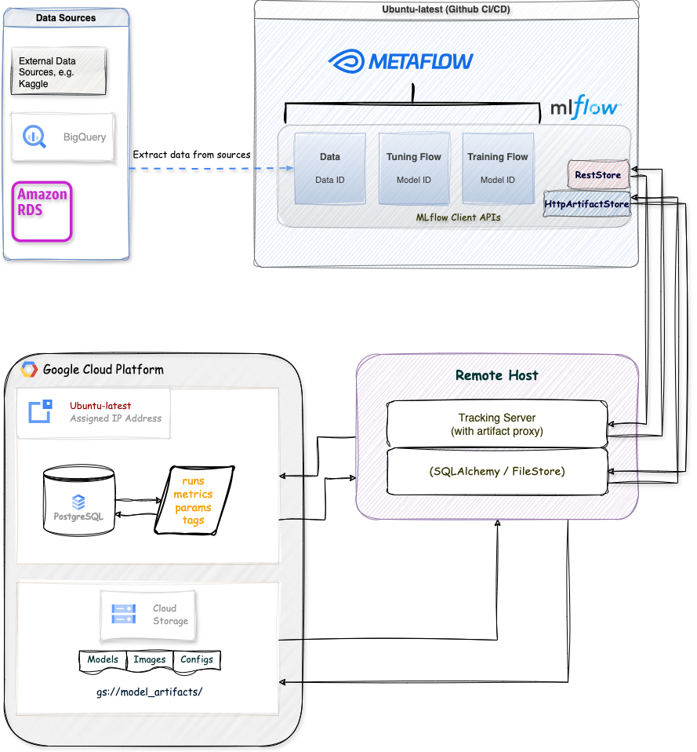
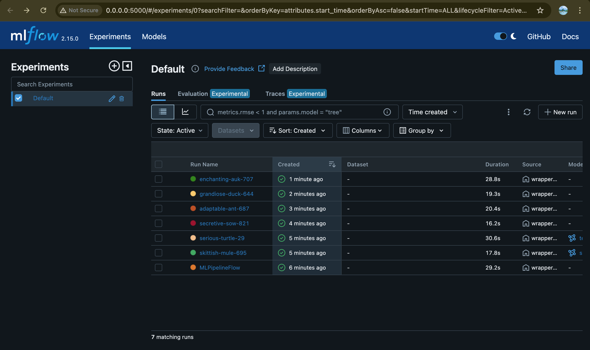
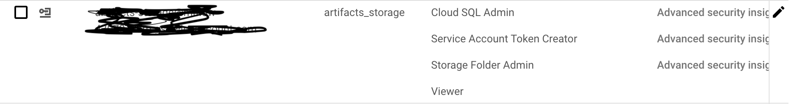
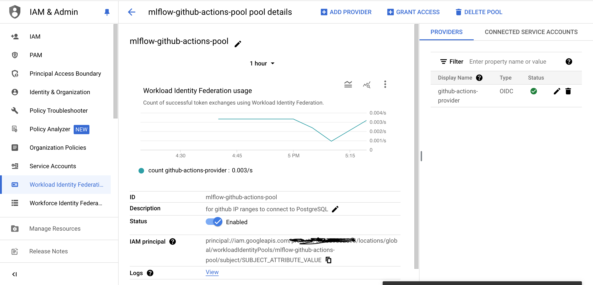
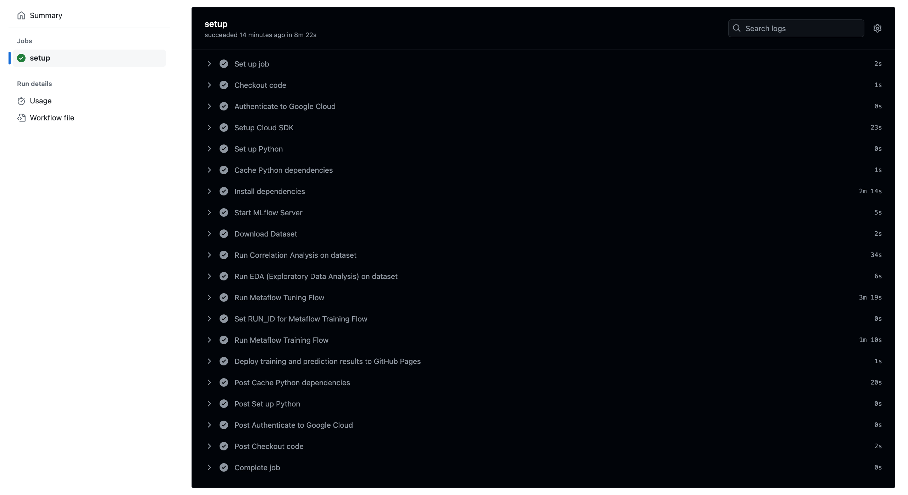

[](https://github.com/Ruhul-Quddus-Tamim/Operational_ML/actions/workflows/main.yml)

# Overview
This project is a demonstration of designing and productionizing of end-to-end MLOps workflows including data preparation, tuning, training models and orchestrate the workflows using Metaflow. Integration of CI/CD pipeline automatically execute these workloads when certain events occur (new data, performance regressions, elapsed time, PR etc.) to ensure that models are always up to date and increasing in quality.

For each experiment tracking, MLOps component used such as MLFlow. The server is setup remotely for experiment tracking with MLflow Tracking Server, in this case Cloud SQL Instance(PostgresSQL) is being used provided by GCP(Google Cloud Platform)

There are many benefits to utilize MLflow Tracking Server for remote experiment tracking:

- **Collaboration:** Multiple users can log runs to the same endpoint, and query runs and models logged by other users.

- **Sharing Results:** The tracking server also serves a Tracking UI endpoint, where team members can easily explore each other’s results.

- **Centralized Access:** The tracking server can be run as a proxy for the remote access for metadata and artifacts, making it easier to secure and audit access to data.

  


# Project Structure:
```
ML_pipeline/
├── .github/
│   └── workflows/
│       └── main.yml                 # GitHub Actions workflow file defining DevOps steps, e.g. CI/CD.
│ 
├── Makefile                         # Makefile containing commands for building, testing, and running the project locally.
├── requirements.txt                 # Python dependencies required to run the project.
├── modules/
│   ├── feature_transformation.py    # Script for feature engineering and data preprocessing.
│   ├── tune_svm.py                  # Script for tuning Support Vector Machine (SVM) hyperparameters.
│   ├── tune_dnn.py                  # Script for tuning Deep Neural Network (DNN) hyperparameters.
│   └── prediction.py                # Script for making predictions using the trained models.
│ 
└── analysis/
│    ├── correlation_analysis.py     # Script for performing correlation analysis on the dataset.
│    └── eda.py                      # Script for performing Exploratory Data Analysis (EDA) on the dataset.
│ 
└── metaflows_flow/
    ├── tuning_flow.py               # Metaflow script for orchestrating the tuning process of ML models.
    └── ml_pipeline_flow.py          # Metaflow script for managing the overall ML pipeline, including data processing, model training, and evaluation.

```

# Database Management
Create a Cloud SQL instance(PostgreSQL), configure the instance: 
1. **Instance ID:** Choose a unique name for your instance.
2. **Password:** Set a strong password for the postgres user.
3. **Database version:** Choose the PostgreSQL version you want (latest stable version recommended unless you have specific requirements).
4. **Region and zone:** Select based on your needs (choose a region close to your users for better performance).

```
-- Connect to PostgreSQL instance
psql -h [INSTANCE_IP] -U postgres

-- Once connected, create the mlflowdata database
CREATE DATABASE mlflowdata;

-- Create the mlflowdata user
CREATE USER mlflowdata WITH PASSWORD 'your_secure_password';

-- Connect to the mlflowdata database
\c mlflowdata

-- Grant all privileges on the database to mlflowdata user
GRANT ALL PRIVILEGES ON DATABASE mlflowdata TO mlflowdata;

-- Grant all privileges on all tables in the public schema to mlflowdata user
GRANT ALL PRIVILEGES ON ALL TABLES IN SCHEMA public TO mlflowdata;

-- Grant all privileges on all sequences in the public schema to mlflowdata user
GRANT ALL PRIVILEGES ON ALL SEQUENCES IN SCHEMA public TO mlflowdata;

-- Grant all privileges on the public schema to mlflowdata user
GRANT ALL PRIVILEGES ON SCHEMA public TO mlflowdata;

-- Make mlflowdata the owner of the public schema
ALTER SCHEMA public OWNER TO mlflowdata;

-- Set default privileges for future tables
ALTER DEFAULT PRIVILEGES IN SCHEMA public GRANT ALL ON TABLES TO mlflowdata;

-- Set default privileges for future sequences
ALTER DEFAULT PRIVILEGES IN SCHEMA public GRANT ALL ON SEQUENCES TO mlflowdata;
```

5. **MLFlow UI:** Once the database is setup along with the Google Cloud Storage Bucket, all the models' artifacts will be available in the MLflow UI




# Service Account and Workload Identity Federation
Google Cloud service account is set up for this project and configured with the necessary permissions to allow secure interaction with cloud resources. Workload Identity Federation (WIF) is used to enable GitHub Actions to authenticate with Google Cloud without the need for long-lived service account keys.

Why Use WIF?

> **1. Enhanced Security:** Eliminates the need to store and manage service account keys, reducing the risk of key exposure.
> 
> **2. Simplified Access Management:** Enables dynamic, token-based authentication, ensuring that GitHub Actions can securely interact with Google Cloud resources based on predefined policies.

This setup ensures that the CI/CD pipeline can securely and efficiently access the required Google Cloud services during workflow execution.

#### Service Account should have those necessary permissions below -




#### Create an OIDC connections using WIF and grant access on this service account -




#### Given all the credetials and connections are successful, then triggering the workflow will automate the complete process -



# Installation and Local Testing
Steps to set up the project locally and run tests using the Makefile.

**Prerequisites**
```
Python 3.8+: The project requires Python 3.8 or later.
Virtual Environment (optional but recommended): For managing project dependencies.
Make: Utility to run the Makefile commands.
PostgreSQL: Set up a PostgreSQL instance, create database and tables and grant access.
Cloud Storage Bucket: Setup a storage bucket in GCS to store artifacts.
```

**Install dependencies**
```
pip install --upgrade pip
pip install -r requirements.txt
```

**Running the Project Locally**

You can use the Makefile to streamline various tasks, such as running analysis, tuning models, and more.

Run MLflow server, tuning and training model
```
make mlflow_server
make tune
make train
make stop
```

# Future Work
> **Model Monitoring and Drift Detection:**

- Implement a model monitoring system to track the performance of deployed models in production and detect any drift over time, triggering re-training when necessary.

> **Scalability Enhancements:**
- Expand the pipeline to handle large-scale datasets and distributed training across multiple GPUs or nodes using tools like TensorFlow Distributed
